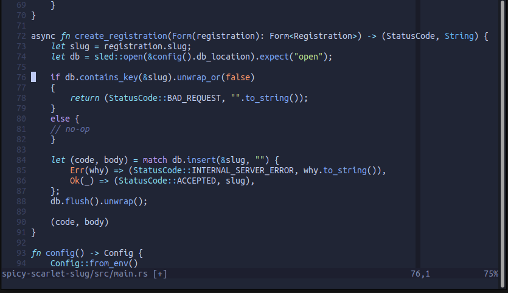
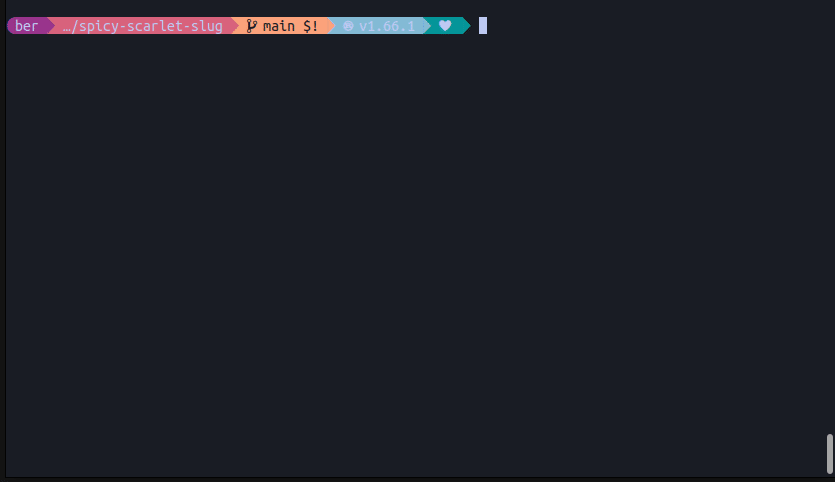
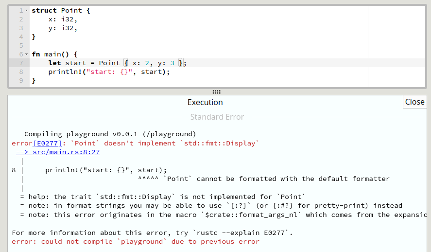

---
author:
  - Bèr `berkes` Kessels
title: "10 reasons to build your next projects in Rust"
subtitle: "A quick introduction to Rust
keywords:
  - rust
  - programming
  - introduction
title-slide-attributes:
    data-background-image: animated-ferris.gif
    data-background-size: contain
lang: en
---

# Rust {background-image="./animated-ferris.gif"}

## About

* Is online: [berk.es/rre-rust](https://berk.es/rre-rust) (github.com/berkes/rust-pres)
* Has very little code.
* Is fast.
* Is in English

## About me {background-image="./ber.jpg"}

* Bèr Kessels
* @berkes@mastodon.nl - https://berk.es
* Entrepeneur (looking for work in a startup as CTO, Tech Lead)

# 10 Reasons to choose Rust as the language for your next project

## 🙋 Who develops in C or C++?
## 🙋 Who uses software (libraries) that are built in C or C++?
## 1. Memory Safety:

* Rust was built to fix this.
* Ownership and borrowing system. 
* RIP null pointer dereferences and buffer overflows.

## 🙋 Who developes in Java, Python, C# or Ruby?
## 2. Speed:

* Rust was built to fix this.
* Zero-cost abstractions.
* Low-level control.
* No Garbage Collector

## 🙋 Who developes software that is used concurrently?
## 🙋 HTTP backends?
## 3. Fearless concurrency:

* Rust wasn't built to fix this. It came for free.
* Ownership system.
* Lightweight threads. First class citizen. 
* No Garbage Collector.

## 🙋 Who uses typescript over Javascript?
## 🙋 Who uses type hints in Python or PHP?
## 4. Type System:

* Rust's type system is powerful and expressive. 
* More precise and correct programs.
* The world is moving there.

## 🙋 Who deploys their software weekly?
## 🙋 Who uses`^D^D`fights docker regularly?
## 🙋 Who runs software on different platforms (dev on macOS, run on linux counts!)
## 5. Cross-platform support

* Compile to Windows, macOS, Linux, and many embedded systems out of the box.
* LLVM: targets *many* platform
* Statically linked by default: build, copy, done; CI config is tiny, cargo has it all.

## 🙋 Who uses third party libraries?
## 🙋 Who is afraid of third party libraries?
## 6. Package manager:

* Built-in package manager called Cargo.
* Huge ecosystem of third party libraries.
* \_\_\_ Left-pad is standardlib.

## 🙋 Who has ever "rewritten from scratch" because every expert left?
## 🙋 Who has to ask other programmers for help?
## 7. Community

* Rust is popular: 2022: 7th year voted as *the most loved language*.
* 2022: *Most wanted*, lands ahead of python.
* All the "big guns" went all-in: Microsoft, Amazon, Facebook, Google, Huawei, Dropbox, etc.
* And Mozilla, where it came from.

## 🙋 Who uses an IDE (and, yes, Vim and Emacs can be IDEs)
## 🙋 Who writes COBOL (and where did you park your Bently?)
## 8. Tooling
  
* Guarantees to run today. And in 10 years.
* Excellent tooling.
* LSP: Rust-analyzer, code completion, syntax highlighting, more - the best across the board.
* Cargo, Formatter, Linter, Clippy.

------------------

------------------

------------------

## 🙋 Who knows what the following means:
* `TypeError: Super constructor null of Foo is not a constructor`

## 🙋 But who knows what the following means:

## 9. Documentation
  
* Comprehensive, well-written.
* Awesome and helpful compiler errors.
* Great books. Great tutorials. Many free.

## 🙋 10. What did I miss?

